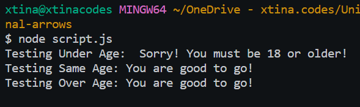

# Conditional Arrows (Core)

<aside>

💡 **Predict the outputs from code blocks featuring modern JavaScript syntax like arrow functions and the ternary operator!**

</aside>

### **Objectives**
- Apply a ternary operator within an arrow function to evaluate a condition and generate output based on the result.
- Demonstrate proficiency in implementing a ternary operator to perform conditional checks and generate appropriate outputs.

### Links
 - [Notion Page Version](https://different-delivery-037.notion.site/Conditional-Arrows-Core-dfe92e24fddc42cbace73e3924736765?pvs=4)
 - [Section Notes](https://different-delivery-037.notion.site/Modern-JavaScript-9302deb4f93d48699228e16d600e360f?pvs=4)


# **Expected Layout Example**

```
 //Problem 1:
const exampleFunction = (param)=> {
    return param === "hello" ? "hello!!!" : "bye bye!"
}
console.log(exampleFunction("hello")) //Output : hello!!!
console.log(exampleFunction("not hello")) //Output : bye bye!

//Problem 2: ...ect
copy
```

# **Problem 1**

### **Write an arrow function that checks to see if a user is older than 18.**

**If they are older than 18, the output should be:**

- "You are good to go!"

**If they are not older than 18, the output should be:**

- "Sorry! You must be 18 or older!"

*The conditional logic should be written with a ternary operator.*

```jsx
const checkAge = e => 
    ( e < 18 ) ? 
        "Sorry! You must be 18 or older!" : 
        "You are good to go!" ;
```



# **Problem 2**

### **Write an arrow function that checks to see if it is currently raining.**

**If it is raining, the output should be:**

- "Get your rain jacket!"

**If it is not raining, the output should be:**

- "No rain on today's forecast!"

*The conditional logic should be written with a ternary operator.*

```jsx
const checkRaining = () => 
     ( Math.random() < 0.5 ) ? 
            "Get your rain jacket!" : 
            "No rain on today's forecast!";
```


# **Problem 3**

### **Write an arrow function that checks to see if a number is even.**

**If it is even, the output should be:**

- "That's an even number!"

**If it is not even, the output should be:**

- "That's an odd number!"

*The conditional logic should be written with a ternary operator.*

```jsx
const checkEven = e => 
    ( e % 2 == 0 ) ? 
        "That's an even number!" : 
        "That's an odd number!" ;
```


# **Problem 4**

### **Write an arrow function that takes in two parameters and checks whether one number is greater than another.**

**If the number is greater, the output should be:**

- <<NUMBER HERE>> is more than <<SECOND NUMBER HERE>>!"

**If the number is less than the other number, the output should be:**

- *"<<NUMBER HERE>> is less than <<SECOND NUMBER HERE>>!"*

*The conditional logic should be written with a ternary operator.*

```jsx
const checkGreatest = (x, y) => {
    let result = ( x == y ) ? 
                    "is equal to" : 
                        // nest for greater or less than
                        ( x  > y) ?
                            "is greater than" :
                            // no condition needed
                            // when it isn't equal or greater 
                            // it has to be less 
                            `is less than` ;

    return `${x} ${result} ${y}`
}
```


# **Ninja Challenge!**

To increase the difficulty, try to write each of your solutions as implicit returns with the least amount of characters possible. Look back to the rules of arrow functions and how we can simplify them further.

- I can do them all in one line.
- It would just be hard to read.
- ***Who am I kidding? That’s literally my favorite thing to do!***
- *I’ll save both 🤣lol.*

```jsx
// Problem 1 ) ---------------------------
const checkAge = e => ( e < 18 ) ? "Sorry! You must be 18 or older!" : "You are good to go!" ;
// Problem 2 ) ---------------------------
const checkRaining = () => ( Math.random() < 0.5 ) ? "Get your rain jacket!" : "No rain on today's forecast!";
// Problem 3 ) ---------------------------
const checkEven = e => ( e % 2 == 0 ) ? "That's an even number!" : "That's an odd number!" ;
// Problem 4 ) ---------------------------
const checkGreatest = (x, y) => ( x == y ) ? `${x} is equal to ${y}` : ( x  >  y) ? `${x} is greater than ${y}` : `${x} is less than ${y}` ;
```


<!-- 👣FOOTER👣 -->
&nbsp;
<hr />
<p align="center">A work by <a href="https://github.com/xtina-lt/">Christina Torres</a></p>
<p align="center"><span style="color: #808080;"><em>xtina_lt@outlook.com</em></span></p>

<!-- Add icon library -->
<link rel="stylesheet" href="https://cdnjs.cloudflare.com/ajax/libs/font-awesome/4.7.0/css/font-awesome.min.css">

<!-- Add font awesome icons -->
<p style="text-align: center;">
    <a href="https://www.linkedin.com/in/xtinacodes/" class="fa fa-linkedin"></a>
    <a href="https://github.com/xtina-lt/" class="fa fa-github"></a>
</p>
&nbsp;
</div>